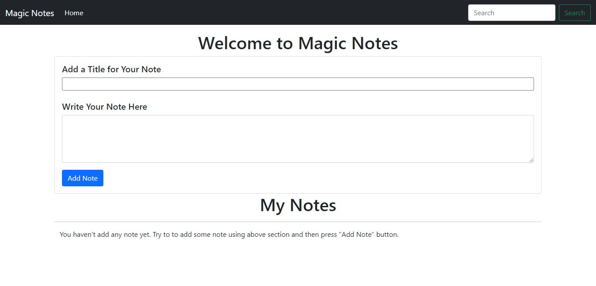

<h1 align="center">Magic Notes App</h1>

### How to Use ?

This is awesome note app where you can add you note, delete any note and search your note.
This app is build using vanilla JavaScript. You can view the app [here](https://uaceit-winter-of-mentorship.github.io/Magic-Notes-App/)

### Tech Stack Used
- JavaScript 
- Bootstrap( just to save time)

### Current UI

### How to get started?

You can refer to the following articles on the basics of Git and Github and also contact the Project Mentors, in case you are stuck:

- [Watch this video to get started, if you have no clue about open source](https://youtu.be/SL5KKdmvJ1U)
- [Forking a Repo](https://help.github.com/en/github/getting-started-with-github/fork-a-repo)
- [Cloning a Repo](https://help.github.com/en/desktop/contributing-to-projects/creating-a-pull-request)
- [How to create a Pull Request](https://opensource.com/article/19/7/create-pull-request-github)
- [Getting started with Git and GitHub](https://towardsdatascience.com/getting-started-with-git-and-github-6fcd0f2d4ac6)

### New Features
- Add tags 
- Give different color to your note
- Give a button to delete all note at time
- Time stamp for note
- Sort Note according to Time, Tags or color

### Do You Want to contribute to this Project ?
I have commented each and everyline of JavaScript so that even a new bie to javascript can also understand what going behind the scene. If you want to implement any feature so create a issue for that then I will let you know how you can create a PR for the same !!. 
